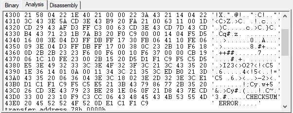

# TRS-80_B-17 Disassembly Folder

Disassembly of the 500-baud pre-loader for reading tapes written by the B-17 cassette software
for the TRS-80 Model I

## Overview

I was able to locate some tapes I had created using B-17 back in the early 1980s,
and wanted to investigate the recording format, and how it was superior to the
native TRS-80 format without requiring any special hardware.

I played the cassette recordings into Audacity, which captured them at 44.1KHz
(however I used mono).  For there, I used Knut Roll-Lund's **excellent** WAV2CAS utility
to detect the contents of the 500-baud header information.
[See Knut Roll-Lund's webpage for more details on the utility](https://knut.one/wav2cas.htm)

In the near future, I plan to write a program in Python to be able to decode WAV files and
display output of the data contained therein.

## Results - Header and Payload

I had fed WAV2CAS a sound file of a B-17-encoded game from the early 1980s, and
WAV2CAS was easily able to decipher the following information from the header:

* NAME = PATROL
* Load Block 1: 2 bytes at 0x401E (pointing to address 0x4300), as an auto-start
* Load Block 2: Block from 0x4300 to 0x43EA, the "B-17 Loader" 
* Entry point: 0x0000 (not used)

WAV2CAS then tried to identify data following that - which turned out to be incorrect, as the following data was
encoded in B-17 format.

Here is what WAV2CAS showed as the contents for Load Block 2:

I then hand-entered this data into a binary file [HERE](B-17_loader.bin), and used MAME's "unidasm"
program to disassemble the contents.

[The full, commented disassembly is here](B-17_loader_disassembly.txt)

## High-Level Analysis

1. The B-17 system - at least for this particular example - is intended to write (and later read) a **CONTIGUOUS** block of data.
2. The pre-loader contains additional memory-block-specific information "injected" into it:
   - The Start-Of-Block address is at 0x431B/1C
   - The Length-Of-Block value is at 0x431E/1F
   - The Entry address is at 0x4327/28
   - The name of the program is actually stored as part of the machine-language header of the pre-loader program (in this case, "PATROL")
3. Bytes of data are written as a precisely-timed series of 8 bits, with the least-significant bit first.
4. There is a "START" bit preceding this 8-bit train; in this way, there can be imprecisely-timed gaps between bytes.
5. Every 256 bytes, there is a checksum byte inserted into the stream (and measured).
6. Instead of the blinking "\*\*" stars in the top right corner of the screen, B-17 implements a marquee which resembles "I<---<---<--O", where the "<" characters are animated to move in the direction fo the "I" as loading proceeds.

A more in-depth analysis of the format can be found [HERE](Theory_of_Operation.md).
