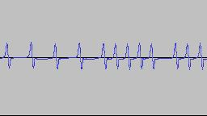
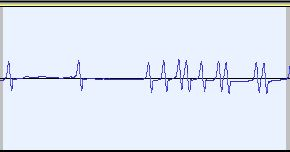

# TRS-80_B-17 Theory Of Operation

## Background

Cassette tapes were chosen as a recording medium in the late 1970s because of how common and inexpensive they
had become by then - NOT because of their fidelity or recording quality.

### Considerations when using cassettes:

Casettes had many issues when used in conjunction with computers - frequency response, dropouts, variations
in motor speed, 60Hz line hum and other noise, and volume levels.

Volume levels tended to be the largest issue on the TRS-80, as it was difficult to set the volume level
(blindly) to the correct level - high enough to be detected, without being so high that distortion or
background noise triggered false positives on the read.

B-17, which used the same hardware as the regular TRS-80 cassette I/O, was not immune to this - but it
made the assumption that if you can load a normal TRS-80 program, then your settings should be sufficient
for the B-17 system as well.

## Tape Formats

### Comparing Bit Modulation

Of course, every file can be decomposed into bytes, and bytes need to be serialized into a series of bits.
The most basic format of storage on cassettes must be a bit, and from there, a more comprehensive protocol
must be constructed.

#### TRS-80 Native Bit-Level Modulation

At the lowest level, the TRS-80 Model 1 wrote bits to tape using pulses. The pulses formed a timebase,
with a separation of 2 milliseconds as a "clock" of sorts; the presence of an additional pulse midway between two
clock pulses (roughly at the 1ms mark) indicated a '1' bit, and the abscence of that additional pulse
indicated a '0' bit.  This 2 millisecond 'clock' is how the "500 baud" speed is derived.

The following image shows the timebase, and two '1' bits toward the right edge - notice how the waveform
no longer appears to be a squarewave, due to the limited frequency response of the medium:

The pulses include both a descending and an ascending pulse (below and above the midway line), so that they
would register even if the input was reverse-polarity. Based on ROM disassemblies, these pulses are each
approximately 450 microseconds wide. The delay between clock pulses is roughly 2 milliseconds, or
1 millisecond in the case of the '1' bit between clocks.

On playback, the clock pulses need to exceed a threshold voltage, in order to trigger a flip-flop to hold
that value until deliberately reset. This flip-flop threshold voltage is almost certainly the reason for
the over-sensitivity of the TRS-80 to volume levels.

The program which reads these pulses:
1. Checks for the flip-flop value to have been triggered (or wait until it is triggered)
2. Resets the flip-flop, waits roughly 1 millisecond (by counting machine cycles), and checks the flip-flop again (midway between clock pulses), to determine whether this is a '0' or '1' bit
3. Resets the flip-flop once again and waits for the remainder of the cycle, to synchronize with the next clock pulse

In this way, a series of pulses represents a series of bits.

Below, we see the bits: 0 0 0 0 1 1 0 1:

#### B-17 Bit-Modulation

Since B-17 used the same hardware, the actual recorded pulses on B-17 recordings closely resemble their
native counterparts - however, the arrangement and timing are quite different.

Rather than using sync pulses to identify individual bits, B-17 uses sync pulses to identify the start of bytes,
with a precisely-timed train of pulses (or lack of pulses) to create a byte.

B-17 arranges these bits with least-significant bit first.

Below, we see the bytes: 00 00 5A 31:

#### B-17 Bit Timing

TO BE ADDED

### TRS-80 Native Format - Assembling Bits into Bytes

In order to assemble bits into bytes, two things must happen:
1. Synchronization of bits at the byte boundary, and
2. Agreement of bit sequence

#### TRS-80 Native Format

In order to synchronize, the start of a file begins with a series of 256 zeroes, followed by a 0xA5 byte.
The bit sequence for TRS-80 format is most-significant bit first, so the bits for the 0xA5 byte are written
in the sequence: 10100101 .  It is significant that the first bit of this sync byte is non-zero.

From this point onward, it is a simple bitstream, with every 8th bit implying a new byte.

The structure of that bitstream is described in the TRS-80 Native tape protocol section below.

#### B-17 Format

After the B-17 loader completes loading, the tape motor stays on, and the loader starts analyzing the
tape input.

There is a lead-in of roughly 24 bytes sync pulses, spaced roughly 4.6 milliseconds apart. As mentioned earlier,
these sync pulses are byte markers, denoting 24 bytes of '0x00' values as a lead-in.

The sync byte then follows, which is a '0x5A' value (least-significant bit first).

From this point onward, the data is a byte stream, with every 256th byte being a checksum.

There is no complex 'block' format or protocol - the data simply represnts a contiguous block of memory
(with checksums every 256th byte).

### TRS-80 Native Format - Overall Tape Protocol

**MACHINE-LANGUAGE PROGRAMS**

| Bytes | Usage | Description |
|-------|-------|-------------|
| -- | Lead-In | The lead-in consists of 256 iterations of '0' bits. This is followed by the sync byte. |
| 01 | Sync Byte | The lead-in is followed by a sync byte of 0xA5 ('Byte 01'). |
| 02 | File Type | The file type for a machine-language program is 0x55. |
| 03-08 | Filename | The filename for the file on tape can be up to 6 characters in length, stored in ASCII, and with trailing spaces if the name is shorted than 6 characters. |
| 09-?? | DATABLOCK | There can be one or more datablocks in the file (minimum one). |
| |  **DATABLOCK FORMAT**: | |
| 01 | Block Type | This is 0x3C for binary data |
| 02 | No. of Bytes | Number of bytes in block. '0x00' implies 256; other values are as stated (i.e. 0x05 = 5) |
| 03-04 | Load Address | This is where the data is to be loaded, least-significant byte first. (i.e. 0x00 0x4B = 0x4B00). Blocks do not need to be contiguous, but generally are continguous. |
| 05-nn | Data | Data bytes to load |
| EOB | Checksum value to validate whether data loaded was correct |
| | **END OF FILE BLOCK**: | |
| 01 | Block type | This is 0x78 to indicate transfer address. |
| 02-03 | Transfer Address | This is where execution is to start, least-significant byte first. (i.e. 0x00 0x4B = 0x4B00). |

