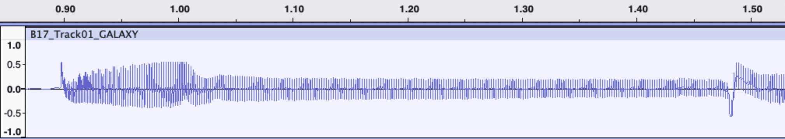
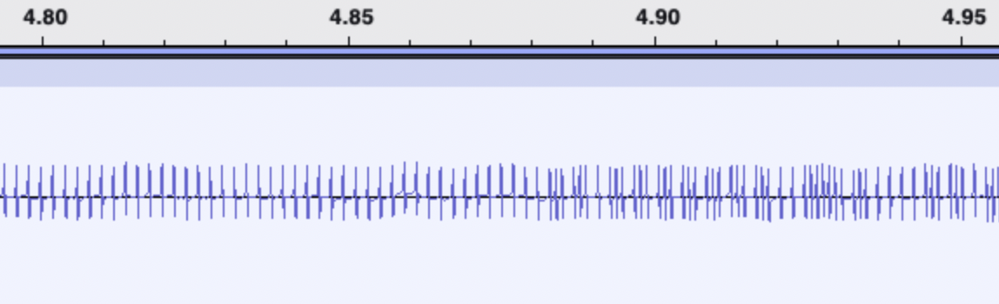
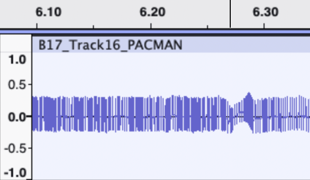
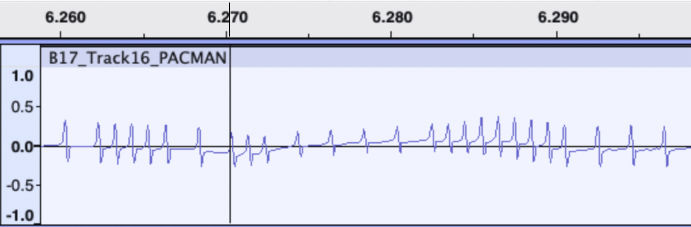
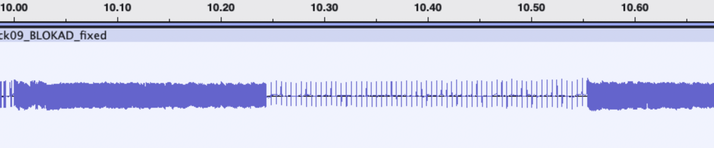
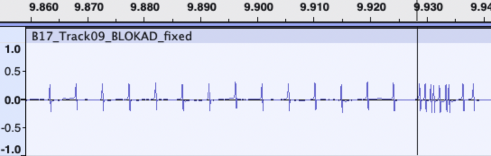
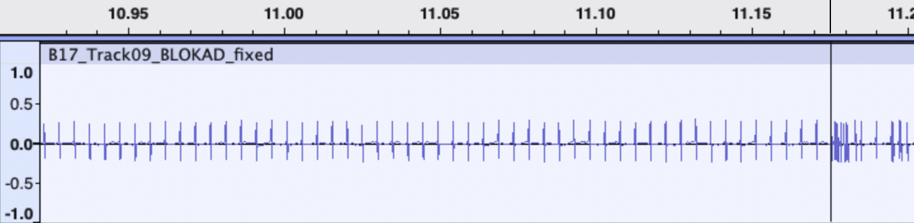

# Audio Treatment

Discussion of some of the possible issues with audio files from 1980's cassette tapes,
and how they may be dealt with.

## Overview

I wrote the "readb17.py" tool to read B-17 files, and it works well with recordings
that are quite homogeneous. However, while testing, I found that some recordings
may have oddities which may best be addressed by editing the audio file (not yet
incorporated into the program).

All descriptions below will be based on using Audacity as the tools to adjust and
make minor corrections.


## Example 1 - "END OF FILE FOUND"

For the first type of failure, I found the "readb17" script looked as follows:
```
python readb17.py B17_Track01_GALAXY.wav 
PCM
Number of channels: 1
Sample Rate (Hz): 44100
Bytes Per Second: 88200
Bits Per Sample: 16
 
num_samples =  2552641
max_val =  19221
 
Setting:
general peak =  7296
threshold    =  4377
END OF FILE FOUND
```

The "END OF FILE FOUND" appeared before it had even recognized the B-17 header and filename.

This means that it probably didn't even locate the sync byte - so we look there.

Zooming in to a certain degree, we find that the start of audio looks like this:



Two things to note here:
1. The immediate startup period is especially loud, but settles down into a normal range
2. Just before the 1.5 second mark, there is a strange wobble to the audio. There are actually a few more of these wobbles during the lead-in section.

This entire section - actually, up to the 4.87 second mark - is the leadin section of the 500 baud portion.
The bits are all identical until that 4.87 second mark, where the sync byte appears.  At that point, the waveform
will change to look something like this:



In this case, the solution was simple - simply delete the roughly 1.6 seconds of bizarre-looking lead-in, since it's not important.
Just be sure not to delete anything after the sync byte (or even close to the sync byte).

## Example 2 - "Error reading at ..."

This issue was not terribly difficult, as the script does attempt to tell (in most cases) you where in the file it has the issue.

```
python readb17.py B17_Track16_PACMAN.wav 
PCM
Number of channels: 1
Sample Rate (Hz): 44100
Bytes Per Second: 88200
Bits Per Sample: 16
 
num_samples =  2199976
max_val =  18917
 
Setting:
general peak =  7680
threshold    =  4608

Filename = 'PACMAN'
B-17 Preloader resides at: 0x4300 through 0x43EA
 
Error reading at  276522
```

Here, it tells me that it started reading the header, but then ran into some sort of issue while trying to
read in the vicinity of sample number 276522.

At a macro level, you can see that this is a wobble in the waveform:


Zooming in, you can see that the pulses are short in this area, and the baseline goes below the line, and then
above the line:


Two fixes need to be done - normalize it so that the baseline is even, and amplify the section where the pulses are too short.

1. Normalize

   - Use Audacity's tools to identify the section that's lower than it should be: use "Effect -> Volume and Compression -> Normalize",
with only the "Remove DC Offset (center on 0.0 vertically)" setting checked. Repeat this for the section that is higher than it
should be as well.  Now you should have a relatively straight section, but with pulses which are still a bit too short.

2. Amplify

   - Use "Effect -> Volume and Compression -> Amplify".  I used a 3dB amplification to make these pulses appear roughly similar
in amplitude to their neighbours, and that seemed to look OK. You can try different amounts, but the amplification level that
will initially be offered by Audactity is almost certainly too much.


Now you can save it to a file and try to reprocess; in my case, it worked fine right after these small tweaks.


## Example 3 - "CHECKSUM ERROR"

This was the most challenging issue found.  Based on the output, it's not easy to determine where the issue is.

```
.
.
.
Boot loader transition to B-17 format at sample number  432711
 
B-17 Payload Program:
   
0x5000: 21 00 51 11 00 42 01 AF 09 ED B0 C3 00 42 FF FF    !.Q..B.......B..
0x5010: FF FF FF FF FF FF FF FF FF FF FF FF FF FF FF FF    ................
0x5020: FF FF FF FF FF FF FF FF FF FF FF FF FF FF FF FF    ................
0x5030: FF FF FF FF FF FF FF FF FF FF FF FF FF FF FF FF    ................
0x5040: 00 00 00 00 00 00 00 00 00 00 00 00 00 00 00 00    ................
0x5050: 00 00 00 00 00 00 00 00 00 00 00 00 00 00 00 00    ................
0x5060: 00 00 00 00 00 00 00 00 00 00 00 00 00 00 00 00    ................
0x5070: 00 00 00 00 00 00 00 00 00 00 00 00 00 00 00 00    ................
0x5080: FF FF FF FF FF FF FF FF FF FF FF FF FF FF FF FF    ................
0x5090: FF FF FF FF FF FF FF FF FF FF FF FF FF FF FF FF    ................
0x50A0: FF FF FF FF FF FF FF FF FF FF FF FF FF FF FF FF    ................
0x50B0: FF FF FF FF FF FF FF FF FF FF FF FF FF FF FF FF    ................
0x50C0: 00 00 00 00 00 00 00 00 00 00 00 00 00 00 00 00    ................
0x50D0: 00 00 00 00 00 00 00 00 00 00 00 00 00 00 00 00    ................
0x50E0: 00 00 00 00 00 00 00 00 00 00 00 00 00 00 00 00    ................
0x50F0: 00 00 00 00 00 00 00 00 00 00 00 00 00 00 00 00    ................
--> CHECKSUM OK = AE
   
0x5100: 21 00 00 31 00 42 22 D7 47 AF 32 DB 47 3E C0 32    !..1.B".G.2.G>.2
0x5110: E9 47 32 5A 49 CD 0F 47 21 60 4A CD 8F 47 3A DB    .G2ZI..G!`J..G:.
0x5120: 47 B7 F2 56 42 32 EA 47 2A D7 47 22 D9 47 21 62    G..VB2.G*.G".G!b
0x5130: 46 CD 8F 47 CD AF 45 11 26 3F CD FB 44 21 CC 48    F..G..E.&?..D!.H
0x5140: CD 8F 47 0E 03 CD 40 44 CD 8C 46 CA 45 42 FE 4E    ..G...@D..F.EB.N
0x5150: C2 9A 42 C3 00 42 21 FB 47 CD 8F 47 CD A5 47 21    ..B..B!.G..G..G!
0x5160: A0 48 CD 8F 47 11 A2 3F 21 B3 47 CD 3C 47 21 C3    .H..G..?!.G.<G!.
0x5170: 48 CD 8F 47 11 B1 3F 21 C6 47 CD 3C 47 21 2A 48    H..G..?!.G.<G!*H
0x5180: 22 DD 47 3E 2C 32 4F 43 21 56 48 22 E3 47 3C 32    ".G>,2OC!VH".G<2
0x5190: 56 43 D9 01 00 00 11 08 02 D9 CD A5 47 21 29 49    VC..........G!)I
0x51A0: CD 8F 41 CD 8C 46 CA A3 42 D6 53 32 5A 49 CD A5    ..A..F..B.S2ZI..
0x51B0: 47 21 F4 48 CD 8F 47 CD F4 46 DA B7 42 CD 0F 47    G!.H..G..F..B..G
0x51C0: 21 00 00 22 D9 47 3E 01 32 DB 47 3A E9 47 3D CA    !..".G>.2.G:.G=.
0x51D0: D5 42 32 E9 47 CD A8 44 3A E9 47 47 21 5B 49 22    .B2.G..D:.GG![I"
0x51E0: A6 44 16 38 5E 23 4E 23 1A A1 C2 09 43 B6 F2 E2    .D.8^#N#....C...
0x51F0: 42 D9 EE 3E 0F DA FB 42 A0 47 21 A1 4F D9 23 7E    B..>...B.G!.O.#~
--> CHECKSUM BAD = 12, read from file = 18
```

From the above, we get only two clues:
1. The B-17 portion starts at sample number 432711
2. The issue is not within with first 256 bytes or its checksum, but somewhere in the next 256 bytes (and/or checksum)

So we go hunting in this region...

We see from the dump of the first block that there are stretches of FF and 00, and those will
look like this:



The darkest part are the FF's, and the mostly-empty part with only individual pulses are the 00's.
We are searching to find the end of the second group of 00's, as it transitions to more complex-looking
patterns, and searching within that block for "something strange".

Now, we see that the sync byte starts at roughly time signature 9.928 seconds...



And the end of the last group of zeroes in the first 256 bytes ends at roughly time signature 11.175 seconds...



This means we are searching for an oddity within the next 1.247 seconds after that: between 11.175 and 12.422 seconds.

And the oddest thing we see, is a section between about 11.96 and 11.985 seconds, where there is a type of tape dropout:
the overall waveform dips and rises in an undulating fashion (it should be centered), and the pulses are much shorter during
this section.

Use Audacity's tools to identify a section that's lower than it should be, and use "Effect -> Volume and Compression -> Normalize",
with only the "Remove DC Offset (center on 0.0 vertically)" setting checked. Repeat this for the section that is higher than it
should be as well.

Now, you will notice that - in this section that is now on the horizontal line - the pulses are still shorter than they should be.
Use "Effect -> Volume and Compression -> Amplify".  I used a 3dB amplification to make these pulses appear roughly similar
in amplitude to their neighbours.

Saving this file to a new WAV file and re-running the "readb17" script was then successful !

